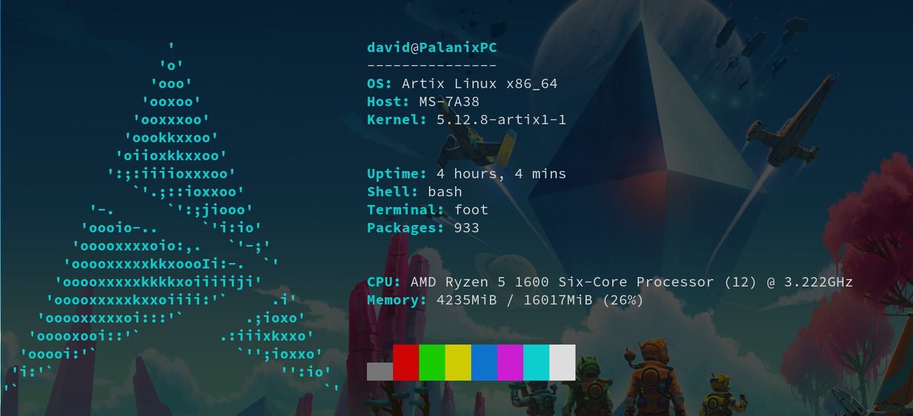
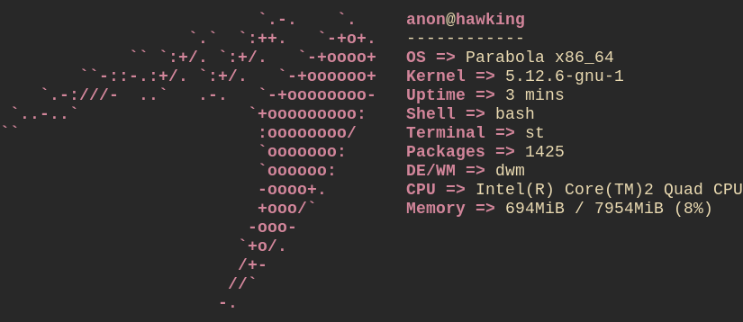

wayfetch
========

A neofetch rewrite that is still lacking some features

I know that the way prefix is usually used for wayland programms.

Although I haven't ported over other logos yet, it is relatively easy to do so. 
Just remember that every line should have equal length, otherwise it's going to mess up the printing. 
Multicolor Logos are a bit harder to do, see mint.h as an example. It's best to start with a normal no color Logo and then add the coloring, to preserver spacing

Displaying package count currently only works with Pacman

Example:




Available Logos
------------
- Tux
- Big tux
- Arch Linux
- Artix Linux
- Debian GNU/Linux
- Devuan
- Fedora GNU/Linux
- FreeBSD
- Gentoo Linux
- GNU Guix
- Hyperbola GNU/Linux-libre
- Parabola GNU/Linux-libre
- Kiss
- Manjaro Linux
- Linux Mint
- OpenSUSE
- Pop\!_OS
- Qubes OS
- Redhat Linux
- Trisquel GNU/Linux

Configuration
-------------

Wayfetch is configured using config.h. The first include defines which logo is used.
The order function defines the order of the entries. Simply change the order of the entries

Performance
-----------

Using hyperfine neofetch uses 140ms and wayfetch 1ms

```
$ time -p wayfetch &>/dev/null
real 0.01
user 0.00
sys 0.00
```
```
$ time -p neofetch &>/dev/null
real 0.53
user 0.28
sys 0.27
```

Criticism is encouraged. 
