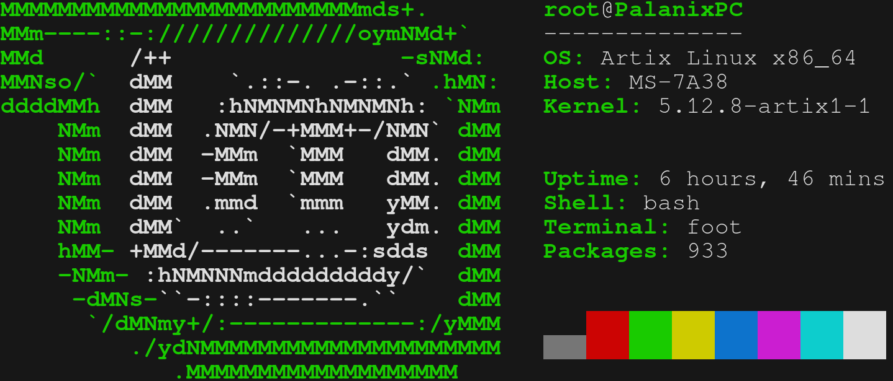

wayfetch
========

A neofetch rewrite that is still lacking some features

The "way" prefix has nothing to do with Wayland

Example:



Available Logos
------------
- Tux
- Big tux
- Arch Linux
- Artix Linux
- Debian GNU/Linux
- Devuan
- Fedora GNU/Linux
- FreeBSD
- Gentoo Linux
- GNU Guix
- Hyperbola GNU/Linux-libre
- Parabola GNU/Linux-libre
- Kiss
- Manjaro Linux
- Linux Mint
- OpenSUSE
- Pop\!_OS
- Qubes OS
- Redhat Linux
- Trisquel GNU/Linux

Although not every logo of every distro/OS is ported, it is relatively easy to do so, even with 0 programming experience. If you need a ported logo, you can do it by yourself and we'll gladly accept it (see Contributing Logos at the bottom)

Configuration
-------------

Wayfetch is configured using config.h. The first include defines which logo is used.
The order function defines the order of the entries. Simply change the order of the entries

Instead you can also use the Autoconfigure script

Performance
-----------

Using hyperfine neofetch uses 140ms and wayfetch 1ms

```
$ time -p wayfetch &>/dev/null
real 0.01
user 0.00
sys 0.00
```
```
$ time -p neofetch &>/dev/null
real 0.53
user 0.28
sys 0.27
```
```
hyperfine "neofetch --config none"
Benchmark #1: neofetch --config none
  Time (mean _ _):     368.7 ms _  13.7 ms    [User: 202.7 ms, System: 172.0 ms]
  Range (min _ max):   344.3 ms _ 387.7 ms    10 runs
```
```
hyperfine "wayfetch"
Benchmark #1: wayfetch
  Time (mean _ _):       3.2 ms _   2.3 ms    [User: 0.9 ms, System: 3.0 ms]
  Range (min _ max):     1.3 ms _  17.8 ms    155 runs
```

Contributing Logos
------------------
- Every line should have equal length, otherwise it's going to mess up the printing. 
- Every logo should have an extra "blank" row full of spaces.
- Modify "#define ROWS n" to rows of the logo without counting the last "blank" row.
- Multicolor Logos are a bit harder to do, see mint.h as an example. It's best to start with a normal no color logo and then add the coloring, to preserver spacing.
- Name files as OS or distro. For example: Linux Mint -> "mint.h", Parabola GNU/Linux-libre -> "parabola.h".

Displaying package count currently only works with Pacman.

Criticism is encouraged. 
